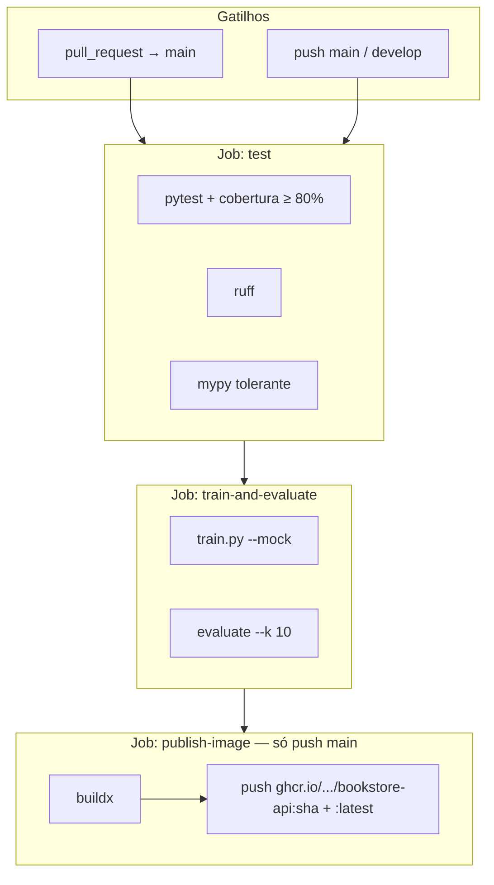
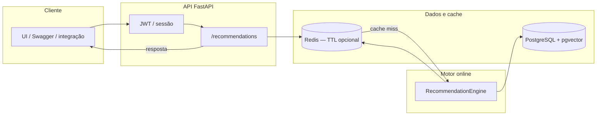
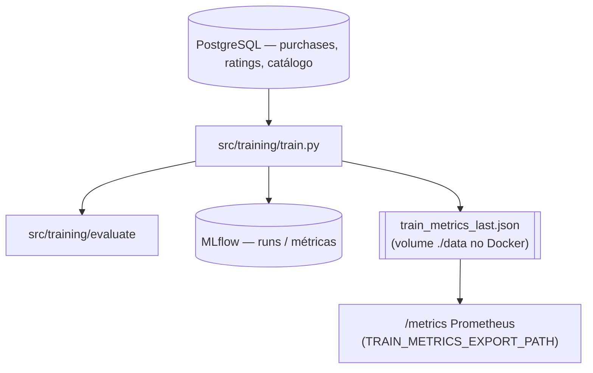
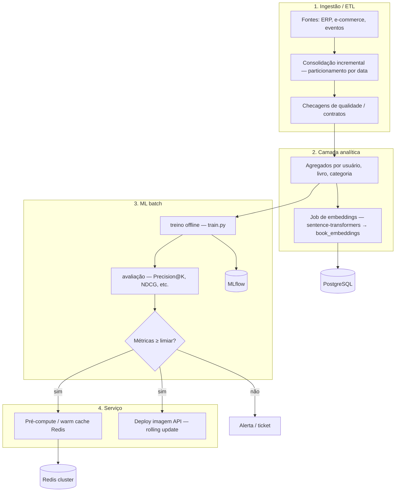
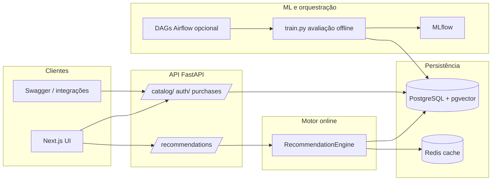

# Bookstore ML — Case de Engenharia de Machine Learning

Solução de referência para um marketplace de livros com **recomendações híbridas** (histórico + colaborativo + **pgvector** / embeddings semânticos), **decaimento temporal**, **pesos por categoria** configuráveis, **sinais demográficos** (região, idade, sexo), **MLflow**, **Airflow (DAGs)**, **CI/CD**, **Prometheus/Grafana** e **Docker Compose**.

## Índice (ordem sugerida)

| Ordem | Seção | Para quê |
|------:|--------|----------|
| 1 | [Documentação do case (entrega)](#1-documentação-do-case-entrega) | Objetivo, diagramas, justificativas, orquestração ideal, escalabilidade |
| 2 | [Visão geral](#2-visão-geral) | Entender o que o repositório faz em uma leitura |
| 3 | [Passo a passo: primeiro uso](#3-passo-a-passo-primeiro-uso) | Subir tudo e ter dados para testar na ordem certa |
| 4 | [Docker: subir e popular dados](#4-docker-subir-e-popular-dados) | Comandos detalhados (`compose`, seed fictício, perfil assertivo) |
| 5 | [Arquitetura (resumo)](#5-arquitetura-resumo) | Onde está cada peça no código |
| 6 | [Variáveis de ambiente](#6-variáveis-de-ambiente) | `.env`, pesos do motor, Redis, embeddings |
| 7 | [Embeddings e pgvector](#7-embeddings-e-pgvector) | Vetores semânticos e limitações em testes |
| 8 | [Erros da API (JSON)](#8-erros-da-api-json) | Formato de falhas nas rotas |
| 9 | [Testes](#9-testes) | Pytest e cobertura |
| 10 | [Comandos úteis e escala grande](#10-comandos-úteis-e-escala-grande) | Treino local, seed pesado |
| 11 | [Frontend](#11-frontend) | Next.js fora do Docker |
| 12 | [Airflow](#12-airflow) | DAGs |
| 13 | [Observabilidade](#13-observabilidade) | Métricas, Grafana, apresentação |
| 14 | [CI/CD e deploy da API](#14-cicd-e-deploy-da-api) | Imagem GHCR, atualização com menos interrupção |
| 15 | [Estrutura do repositório](#15-estrutura-do-repositório) | Pastas principais |

---

## 1. Documentação do case (entrega)

Seção para **apresentação do case**: objetivo, diagramas, justificativa de tecnologias, visão de solução, visão técnica, orquestração em produção, escalabilidade, como o trabalho foi encadeado, limitações honestas e conclusão. O restante do README é o **manual operacional** (Docker, testes, CI/CD).

### Objetivo e escopo

- **Objetivo**: demonstrar um **marketplace de livros** com **recomendações híbridas** — histórico de compras, usuários semelhantes (demografia + comportamento) e, opcionalmente, **similaridade semântica** (embeddings + **pgvector**), com **pesos configuráveis** por tipo de sinal e por categoria.
- **Fora de escopo** (explícito): recomendações em tempo real na escala de grandes varejistas; **alta disponibilidade** multi-réplica no Compose de desenvolvimento; **pagamentos** reais; **modelo único** servido a partir do MLflow Model Registry; ETL de vendas de produção completo — no repositório há um **placeholder** que valida conexão; abaixo descrevemos o **fluxo ideal** para produção.
- **Critérios de sucesso do case**: stack **reproduzível** (Compose); **API** e **UI** demonstráveis; **motor** explicável; **treino offline** comparando algoritmos com métricas de ranking; **observabilidade** (métricas operacionais + eco das métricas de treino); **CI/CD** publicando imagem da API.

### Diagramas

#### CI/CD (GitHub Actions → GHCR)

O workflow **ML Pipeline CI/CD** (`.github/workflows/ml-pipeline.yml`) roda em **pull request** (gate de qualidade) e em **push** para `main` / `develop` (incluindo publicação da imagem só em `main`).



Deploy pontual da API no servidor reutiliza Postgres/Redis já em execução — ver [seção 14](#14-cicd-e-deploy-da-api).

#### Fluxo de recomendação (runtime)



Resumo: a API consulta **Redis** por resultado em cache; em **miss**, o **RecommendationEngine** lê **histórico**, **vizinhos** (demografia + comportamento) e, se houver linhas, **vetores** (`book_embeddings` + HNSW), fusiona scores e grava o resultado no Redis conforme `REC_CACHE_TTL`.

#### Treino e avaliação offline



O **MLflow** registra experimentos; a **API** pode expor métricas offline consolidadas no endpoint `/metrics` quando o arquivo JSON está montado — ver [Observabilidade](#13-observabilidade).

#### Orquestração — estado atual no repo × fluxo ideal em produção

**No repositório**, as DAGs em `dags/` (`dag_etl_vendas`, `dag_train_model`, `dag_evaluate_model`, `dag_compute_recs`) são **independentes**; o ETL de vendas hoje só valida `SELECT 1` contra `DATABASE_URL` (placeholder documentado no código).

**Fluxo ideal em produção** (um grafo coerente, com dependências explícitas e *gates*):



Na prática: **Airflow** (ou equivalente) orquestra **ETL diário** → materialização de tabelas ou *views* estáveis → **treino** (com *dataset snapshot* ou janela móvel) → **avaliação** com limiares → só então **invalidação seletiva de cache** e **deploy** da imagem já testada no CI. Isso substitui DAGs soltas por um **DAG mestre** ou *sensors* entre DAGs (`dag_etl_vendas >> dag_train_model >> …`).

### Justificativa tecnológica (o porquê de cada peça)

| Tecnologia | Por que faz sentido neste case |
|------------|--------------------------------|
| **FastAPI + Uvicorn** | API assíncrona, tipagem com Pydantic, OpenAPI automático (`/docs`) para integração e demo; baixa latência para I/O com banco e Redis. |
| **PostgreSQL + pgvector** | Um único sistema transacional para catálogo, compras e **vetores**; evita sincronizar feature store separada só para demonstração; **HNSW** no pgvector dá busca aproximada eficiente em similaridade de cosseno. |
| **Redis** | Cache de recomendações com **TTL** reduz carga no Postgres e estabiliza latência; em escala, vira **Redis Cluster/Sentinel** compartilhado por várias réplicas da API (ver abaixo). |
| **MLflow** | Padroniza **runs**, hiperparâmetros e métricas offline sem acoplar o motor de produção a um único algoritmo vencedor — útil para o case comparar TF-IDF, CF, SVD, XGBoost, MLP. |
| **Airflow** | Ponto de ancoragem para **ETL**, **treino**, **avaliação** e jobs de **pré-compute** em agendamento; mesmo com placeholders, mostra onde o encadeamento viveria em empresa. |
| **Prometheus + Grafana** | Métricas **pull** (`/metrics`) são o padrão de mercado para SRE; Grafana agrega operação + *dashboard* de métricas de treino exportadas. |
| **Docker + Compose** | Reprodução idêntica em qualquer máquina; **imagem da API** publicada no **GHCR** é o mesmo artefato que sobe em staging/produção (paridade dev/prod). |
| **GitHub Actions** | CI próximo ao código, *secrets* para registry, matriz simples (teste → treino sintético → *build/push*) sem custo de orquestrador externo para o case. |
| **Next.js** | UI moderna para catálogo, cadastro com demografia e painel admin, consumindo a API REST já documentada. |

### Arquitetura de solução (negócio)

| Ator | Ação principal |
|--------|------------------|
| **Visitante / leitor** | Explora catálogo, se registra, atualiza perfil (demografia), compra livros (simulado na API). |
| **Sistema de recomendação** | Calcula ranking personalizado por usuário com base em histórico, vizinhos e vetores de texto. |
| **Administrador da loja** | Consulta compras globais, gerencia livros (API/UI), opcionalmente ajusta pesos de categoria (`ADMIN_TOKEN`). |
| **Equipe de ML / dados** | Roda seeds, treino, avaliação; consulta MLflow e dashboards Grafana (perfil monitoring). |

Fluxo resumido: **dados** (usuários, livros, compras) na **PostgreSQL** alimentam o **motor em runtime**; o **treino** lê os mesmos dados para **experimentos offline** e exporta métricas; o **CI** valida código e publica a **imagem da API**.

### Arquitetura técnica (visão global)

Complementa a [seção 5](#5-arquitetura-resumo) (lista de componentes). Aqui: **fluxo de dados** e **fronteiras**.



- **Fronteira importante**: o **motor que responde em `/recommendations`** é o **`RecommendationEngine`** (código + dados na BD). O **MLflow** registra **runs de experimentos** (vários algoritmos, métricas offline). **Promoção automática** de um artefato para substituir o motor **não está ligada**; o encaixe está **desenhado** (ver abaixo).

### Próximo passo: ranker online no MLflow (roadmap para slides)

**Frase pronta:** *“Hoje a API usa o motor híbrido explicável em produção; o `train.py` compara algoritmos no MLflow. O próximo passo é **promover o melhor run** ao Model Registry (`python -m src.training.register --promote-if-better`), fazer **`log_model`** no treino para o run ter artefato, e **carregar esse modelo** em `src/recommendation/online_ranker_gateway.py` para ranquear online — com **fallback** para o `RecommendationEngine` se o modelo falhar ou faltar feature.”*

**O que já existe no repositório (esqueleto, sem mudar o comportamento padrão):**

| Peça | Função |
|------|--------|
| `src/recommendation/online_ranker_gateway.py` | Se `USE_MLFLOW_ONLINE_RANKER=1`, a rota tenta o ranker MLflow primeiro; **hoje devolve sempre `None`** → a API continua no motor heurístico. Cabe implementar load + predição. |
| `GET /health` | Campo `recommendation_ranker` com `backend: heuristic` e estado do flag (`mlflow_online_ranker: off` ou `stub`). |
| `GET /api/v1/recommendations` | Com o flag ligado, header **`X-MLflow-Online-Ranker: stub-fallback-heuristic`** deixa explícito que ainda não há inferência MLflow. |
| `src/training/register.py` | Escolhe o melhor run por métrica e, com `--promote-if-better`, tenta criar versão em *Production* (exige artefato `runs:/…/model` no run — hoje o `train.py` não faz `log_model`; é parte do próximo passo). |

### Escalabilidade e prontidão para escala horizontal

O desenho atual já aponta para **escalar por réplicas**, sem reescrever o núcleo:

| Aspecto | Como o projeto se alinha |
|---------|---------------------------|
| **API stateless** | A lógica de recomendação não guarda estado de sessão no processo da API: **JWT** autentica cada request; **histórico e perfil** vêm do Postgres; **cache** opcional fica no **Redis** (compartilhado entre instâncias). Várias réplicas atrás de um balanceador (NGINX, ALB, *Ingress*) servem o mesmo tráfego sem *sticky session* obrigatório para o motor. |
| **Redis em escala** | No Compose há um nó único; em produção, substitua por **Redis Cluster** ou **Primary + Réplicas + Sentinel** com a mesma `REDIS_URL` (ou *discovery* do cliente). Invalidação de cache após treino/ETL pode usar **TTL curto**, **pub/sub** ou **versionamento de chave** (`:v2`). |
| **Imagem pronta para Kubernetes** | O `Dockerfile` empacha a app com `uvicorn` e porta **8000**; em k8s você mapeia **liveness/readiness** para `/health` (e opcionalmente dependência de Postgres/Redis nos probes). O CI já produz tags **imutáveis** (`:sha`) e `:latest` no **GHCR** — padrão para `image:` no manifest e *rollout* com `strategy: RollingUpdate`. |
| **Postgres** | O gargalo tende a ser **leitura** do motor; mitigação típica: réplicas de leitura, pooler (**PgBouncer**) e índices (incluindo HNSW). O case mantém um nó por simplicidade. |
| **Workers de embedding/treino** | Jobs pesados (**Airflow** *KubernetesPodOperator*, **CronJob** k8s ou fila) rodam **fora** das réplicas da API, evitando competir por CPU com requests. |

### Plano de implementação (como o case foi encadeado)

Ordem lógica seguida no desenvolvimento (espelhada na estrutura do repo):

1. **Dados e persistência** — schema PostgreSQL (`docker/init.sql`), modelos SQLAlchemy, repositórios, **seed** sintético.
2. **Motor de recomendação** — fusão histórico / colaborativo / vetorial, pesos e cache Redis.
3. **API REST** — catálogo, auth, compras, recomendações, erros JSON consistentes.
4. **Treino e avaliação offline** — `train.py`, algoritmos comparáveis, MLflow, export `train_metrics_last.json`.
5. **Observabilidade** — Prometheus (`/metrics`), Grafana provisionado, métricas offline expostas via arquivo.
6. **Frontend** — vitrine, conta, compras, painel admin.
7. **Orquestração (esboço)** — DAGs Airflow (`dag_etl_vendas` placeholder, treino **@hourly**, avaliação, warm cache); no Docker, perfil **`hourly-train`** para batch de treino; produção ideal descrita acima.
8. **Qualidade e CI/CD** — pytest + cobertura, Ruff, pipeline GitHub Actions, imagem no GHCR, script de deploy da API.

### Limitações e melhorias futuras

| Área | Limitação atual | Melhoria típica |
|------|-----------------|-----------------|
| **ETL** | `dag_etl_vendas` só valida conexão | Agregações incrementais, *feature store*, ingestão de arquivos e contratos de dados |
| **Treino ↔ produção** | Modelos do `train.py` não são servidos online; gateway MLflow é **stub** | `log_model` no treino, `register.py --promote-if-better`, inferência em `online_ranker_gateway.py` |
| **Métricas online** | *Gauges* para CTR/drift sem pipeline completo | Eventos *impression/click*, jobs batch |
| **Orquestração** | DAGs independentes no repo | DAG mestre ou dependências cruzadas: dados → treino → avaliação → warm cache → deploy |
| **Deploy** | Um container API no Compose, janela curta de restart | Várias réplicas + balanceador, *rolling update* (k8s/Swarm) |
| **Versionamento de dados** | Estado da BD no momento do treino | *Snapshots*, *data contracts*, linhagem |

### Considerações finais

Ao concluir este case, **priorizei** que qualquer pessoa conseguisse **reproduzir** o ambiente com Docker, repetir o seed e ver recomendações de ponta a ponta sem depender de infraestrutura fechada. Para mim, faz sentido manter o **motor de recomendação** (histórico, vizinhos e, quando há dados, vetores) **separado** dos experimentos no MLflow: assim ficou claro o que é **serviço em produção** e o que é **laboratório de comparação de algoritmos** — mesmo sabendo que, num cenário empresarial, eu ligaria depois artefatos de treino ao que roda na API.

As escolhas que mais me custaram a equilibrar foram **tempo** versus **realismo** (ETL completo, HA, métricas online de clique): deixei isso explícito nas limitações porque prefiro **assumir o recorte** a prometer um pipeline fechado que não está implementado. O que mais valorizo no que entreguei é a **explicabilidade** do ranking (pesos, perfil, vizinhos) e o fato de o stack já incluir **testes**, **observabilidade** e **CI/CD** como parte do aprendizado, não como extra opcional.

---

## 2. Visão geral

- **Código**: [github.com/thejonathassilva/book-recomendation](https://github.com/thejonathassilva/book-recomendation) (repositório público de referência).
- **Problema**: recomendar livros combinando histórico do usuário, gostos de leitores parecidos (demografia + comportamento) e **similaridade de texto** (embeddings em PostgreSQL com **pgvector**).
- **Como experimentar rápido**: Docker Compose sobe API, Postgres (com pgvector), Redis, MLflow; opcionalmente interface web e monitorização.
- **Dados de demo**: script sintético (`seed_data`) que gera usuários, livros, compras e avaliações para o motor ter sinal controlável.

---

## 3. Passo a passo: primeiro uso

Siga nesta ordem até conseguir abrir a API e o catálogo com dados.

1. **Clonar o repositório** (você só precisa de **Docker** para o fluxo abaixo).
2. **Subir o backend**: `docker compose up -d --build` e aguardar os serviços ficarem saudáveis (`docker compose ps`).
3. **Popular o banco de dados** com o seed sintético: `docker compose exec api python -m src.data.seed_data`  
   (opcional mais leve: `docker compose exec api python -m src.data.seed_data --users 500 --books 300 --purchases 8000`.)
4. **(Opcional)** **Embeddings** para o ramo semântico: `docker compose exec api python -m src.data.sync_book_embeddings` (demora; exige PyTorch no container).
5. **Abrir no browser**: API em [http://localhost:8000](http://localhost:8000), documentação em [/docs](http://localhost:8000/docs). Com perfil `ui`: [http://localhost:3001](http://localhost:3001). Após o seed: usuário demo **demo@bookstore.com** / **demo123**; **administrador da loja** (painel de compras e livros na UI) **admin@bookstore.com** / **admin123**. **Painel admin**: [http://localhost:3001/admin](http://localhost:3001/admin) — requer login com conta `is_admin`. **Token estático da API** (ex.: `PATCH` de peso por categoria sem JWT): `ADMIN_TOKEN` + header `X-Admin-Token`; ver [Variáveis de ambiente](#6-variáveis-de-ambiente).
6. **(Opcional)** Afinar o motor com variáveis `REC_W_*` (ver [seção 4](#4-docker-subir-e-popular-dados) e [seção 6](#6-variáveis-de-ambiente)).

---

## 4. Docker: subir e popular dados

### Subir o stack

Backend (Postgres, Redis, MLflow, API):

```powershell
docker compose up -d --build
```

Com interface Next.js (porta **3001**):

```powershell
docker compose --profile ui up -d --build
```

Com Prometheus + Grafana:

```powershell
docker compose --profile monitoring up -d --build
```

**Tudo junto** (API, Postgres, Redis, MLflow, **UI** e **monitoring** num só comando):

```powershell
docker compose --profile ui --profile monitoring up -d --build
```

### Treino em batch agendado (MLflow + métricas)

O serviço **`train_scheduler`** (perfil Compose **`hourly-train`**) executa `python -m src.training.train` em loop: cada ciclo gera **um run por algoritmo** no experimento MLflow (`book-recommendation`) e atualiza `data/train_metrics_last.json` (mesmo volume que a API usa em `/metrics`). Os runs compartilham a tag **`train_batch_id`** (timestamp UTC) para filtrar no MLflow UI.

**Intervalo entre treinos** — variável de ambiente **`TRAIN_INTERVAL_SECONDS`** (inteiro, segundos). Padrão no Compose: **3600** (1 h). O Docker Compose lê o valor do arquivo **`.env`** na raiz do repositório (copie de `.env.example`) **ou** do ambiente do shell no momento do `up`.

| Situação | O que fazer |
|----------|-------------|
| Dia a dia | `TRAIN_INTERVAL_SECONDS=3600` no `.env` (ou omita e use o padrão). |
| Apresentação / demo | No `.env`, por exemplo `TRAIN_INTERVAL_SECONDS=180` (3 min) ou `120` (2 min) para novos runs aparecerem mais rápido no MLflow. |
| Mudou o `.env` com o scheduler já no ar | Recrie o serviço para pegar o novo valor: `docker compose --profile hourly-train up -d --force-recreate train_scheduler` |

1. Suba a stack base e **rode o seed** (sem compras o treino encerra com erro).
2. (Opcional) Ajuste **`TRAIN_INTERVAL_SECONDS`** no `.env` conforme a tabela acima.
3. Ative o agendador:

```powershell
docker compose --profile hourly-train up -d --build
```

**PowerShell só na sessão atual** (sem editar `.env`):

```powershell
$env:TRAIN_INTERVAL_SECONDS = "300"
docker compose --profile hourly-train up -d --build
```

Logs: `docker compose logs -f train_scheduler`. Para desligar: `docker compose --profile hourly-train stop train_scheduler` (ou `down`). Em máquina fraca, use intervalo maior (ex.: `86400`) ou rode o treino só manualmente.

### Seed fictício (padrão do case)

**Padrão** (sem flags): **2000** usuários (inclui conta demo), **1500** livros, **48000** compras, **4000** avaliações — ver `src/data/seed_data.py` (`--users`, `--books`, `--purchases`, `--ratings`). **Embeddings** (pgvector + PyTorch): `--embed` no seed ou `sync_book_embeddings` depois (um vetor por livro).

```powershell
docker compose exec api python -m src.data.seed_data
docker compose exec api python -m src.data.sync_book_embeddings
```

Para subir mais rápido sem vetores: `seed_data --users 500 --books 300 --purchases 8000` (sem `--embed`).

### Ambiente limpo (zerar dados do Docker)

Para **apagar volumes** (Postgres zerado, etc.) e subir de novo:

```powershell
docker compose down -v --remove-orphans
docker compose up -d --build
docker compose exec api python -m src.data.seed_data
```

### Comportamento mais assertivo no motor

Com **embeddings** preenchidos, você pode subir o peso de **vizinhos** (`REC_W_SIM`) e do **vetor** (`REC_W_VEC`) frente ao histórico (`REC_W_OWN`). Exemplo: **0,30 / 0,45 / 0,25**. No Docker, descomente as linhas `REC_W_*` em `docker-compose.yml` (serviço `api`), rode de novo `docker compose up -d`; com Redis, invalide cache (`REC_CACHE_TTL`) ou reinicie a API.

### Onde clicar depois do seed

| Serviço | URL |
|--------|-----|
| API | http://localhost:8000 |
| Swagger | http://localhost:8000/docs |
| MLflow | http://localhost:5000 |
| UI (perfil `ui`) | http://localhost:3001 · cadastro em `/cadastro` |
| Painel admin (UI, JWT `is_admin`) | http://localhost:3001/admin — compras globais, CRUD de livros, atalhos MLflow |
| Prometheus (perfil `monitoring`) | http://localhost:9090 |
| Grafana (perfil `monitoring`) | http://localhost:3000 (admin/admin) |

**Nota sobre o motor**: **`REC_W_OWN` (histórico próprio)** só altera o score quando o usuário **tem compras**. Sem compras, esse termo multiplica zero; a recomendação vem de **`REC_W_SIM`** e, com embeddings, de **`REC_W_VEC`** (incluindo cold start por vizinhos).

---

## 5. Arquitetura (resumo)

- **API**: FastAPI (`src/api/`) — auth JWT, catálogo, recomendações, métricas Prometheus em `/metrics`.
- **Motor de recomendação**: `src/recommendation/engine.py` — perfil próprio + colaborativo (demografia 30% / comportamento 70% na busca de vizinhos) + **similaridade vetorial** (`book_embeddings` com `sentence-transformers`, índice HNSW).
- **Treino / comparação de algoritmos**: `src/training/` — TF-IDF, user–user CF, SVD, XGBoost, MLP (proxy de NCF); métricas Precision@K, Recall@K, NDCG@K, MAP.
- **Dados**: PostgreSQL **com pgvector** (`pgvector/pgvector:pg16`), schema em `docker/init.sql`, seeds em `src/data/`.
- **Cache**: Redis (TTL recomendações; opcional se `REDIS_URL` vazio).
- **Orquestração**: DAGs em `dags/` (ETL placeholder, treino, avaliação, pré-compute Redis); fluxo ideal em produção na [seção 1](#1-documentação-do-case-entrega).
- **Frontend**: Next.js em `frontend/` (porta 3001).

---

## 6. Variáveis de ambiente

Copie `.env.example` para `.env`. **Ao mudar stack, env ou comportamento do motor**, mantenha README e `.env.example` alinhados.

**Base**: `DATABASE_URL`, `REDIS_URL`, `MLFLOW_TRACKING_URI`, `JWT_SECRET`, `CONFIG_DIR`. Em desenvolvimento local sem Redis, deixe `REDIS_URL` vazio para desativar cache.

- **Treino sem servidor MLflow**: `MLFLOW_TRACKING_URI=file:./mlruns` (padrão no `train.py` se não definido).
- **Admin JWT**: usuários com `is_admin=true` na tabela `users` (seed: `admin@bookstore.com`) acessam `GET /api/v1/admin/purchases`, `POST/PATCH /api/v1/admin/books`, e ao painel `/admin` na UI.
- **Admin token HTTP**: `ADMIN_TOKEN` — `PATCH /api/v1/catalog/categories/{id}/weight` com header `X-Admin-Token` (automação sem JWT).
- **Perfil para recomendações**: no cadastro (`POST /api/v1/auth/register`) informe `birth_date`, `gender` (M/F/Outro) e `region` (ex.: UF). Depois do login, `GET/PATCH /api/v1/users/me` ajusta nome e demografia usados na similaridade entre leitores; o **histórico de compras** vem das linhas em `purchases` (seed ou integração futura de checkout).
- **Pesos do motor (API)**: `REC_W_OWN`, `REC_W_SIM`, `REC_W_VEC` (padrão 0,50 / 0,35 / 0,15) — fusão histórico + colaborativo + vetor pgvector.
- **Cache de recomendações (Redis)**: `REC_CACHE_TTL` em segundos (padrão `3600`).
- **Modelo de embedding**: `EMBEDDING_MODEL` (opcional; padrão `paraphrase-multilingual-MiniLM-L12-v2`). Exige tabela `book_embeddings` preenchida (`sync_book_embeddings` ou `seed_data --embed`).
- **Métricas offline em `/metrics`**: `TRAIN_METRICS_EXPORT_PATH` aponta para o JSON gerado por `train.py` (no Docker a API usa `/app/data/train_metrics_last.json` via volume `./data`).
- **Intervalo do batch de treino (Compose)**: `TRAIN_INTERVAL_SECONDS` — segundos entre execuções de `train.py` no `train_scheduler` (perfil `hourly-train`); padrão **3600**. Ajuste no `.env` ou no shell antes do `up` (útil no dia da apresentação); após mudar `.env`, use `--force-recreate train_scheduler`.
- **Ranker MLflow online (esqueleto)**: `USE_MLFLOW_ONLINE_RANKER` — `1` / `true` ativa o *hook* na rota de recomendações; **a resposta continua vindo do motor heurístico** até implementar inferência no gateway. Ver subseção **Próximo passo: ranker online no MLflow** na [seção 1 — Documentação do case](#1-documentação-do-case-entrega).

---

## 7. Embeddings e pgvector

- **Schema**: `docker/init.sql` cria `book_embeddings` (vetor **384** dimensões, alinhado ao modelo padrão) e índice **HNSW** (cosine).
- **Popular**: após seed ou ingestão de livros, `python -m src.data.sync_book_embeddings` ou `python -m src.data.seed_data --embed` (demora; carrega PyTorch / `sentence-transformers`).
- **Sem linhas na tabela**: o ramo semântico contribui **0**; histórico e colaborativo seguem ativos.
- **Testes locais** (`pytest`): costumam usar **SQLite** — pgvector fica desativado; o comportamento vetorial é exercitado em ambiente PostgreSQL.

---

## 8. Erros da API (JSON)

Falhas nas rotas retornam JSON no formato `{"error": {"code": "...", "message": "..."}}` (códigos estáveis em `src/api/errors.py`; handlers em `src/api/handlers.py`). Erros de validação (422) incluem `error.details` no estilo Pydantic. Erros não tratados respondem com `INTERNAL_ERROR` e são registrados no log do processo (evita depender da mensagem em produção).

---

## 9. Testes

Suíte em `tests/` com **pytest** e **pytest-cov**. A cobertura **mínima de 80%** em `src/` é verificada no **CI** (`pytest … --cov-fail-under=80` na suíte completa). Localmente o `pyproject.toml` só liga o relatório de cobertura; para repetir o gate antes do push, use `pytest tests/ --cov=src --cov-report=term-missing --cov-fail-under=80`. Os scripts de entrada (`seed_data`, `sync_book_embeddings`, `train`, `register`) estão **omitidos** do cálculo de cobertura.

```powershell
pytest tests/ -v
pytest tests/ -m "not slow"
pytest tests/ --cov=src --cov-report=term-missing --cov-fail-under=80
```

---

## 10. Comandos úteis e escala grande

```powershell
pip install -r requirements.txt
ruff check src tests
python -m src.training.train --mock
python -m src.data.seed_data --users 10000 --books 5000 --purchases 200000
python -m src.data.seed_data --embed
python -m src.data.sync_book_embeddings
```

### Escala grande (stress / muito insumo para treino)

Exemplo (**20k usuários, 100k livros, 3M compras, 200k avaliações**):

```powershell
docker compose exec api python -m src.data.seed_data --users 20000 --books 100000 --purchases 3000000 --ratings 200000
```

- **Faz sentido** para encher o pipeline de ML, stress do banco e gráficos de monitoração — desde que a máquina e o volume Docker aguentem.
- **Média** ~150 compras por usuário (3M ÷ 20k), coerente com demo pesada.
- **`sync_book_embeddings`**: um vetor por livro → **~100k** embeddings; pode levar **muito tempo** e CPU (etapa separada).
- **Disco Postgres**: pode ir a **dezenas de GB** com dados + índices (pgvector HNSW em `book_embeddings` também ocupa espaço).
- **`train.py`**: com **milhões** de linhas em `purchases` pode exigir **muita RAM** ou evoluções futuras (chunking / amostragem).

---

## 11. Frontend

```powershell
cd frontend
npm install
$env:NEXT_PUBLIC_API_URL="http://localhost:8000"
npm run dev
```

Abra http://localhost:3001.

---

## 12. Airflow

DAGs estão em `dags/`. Para um ambiente Airflow completo, use a imagem oficial, monte o repositório e instale dependências com `requirements-airflow.txt` (ver `Dockerfile.airflow`). O **fluxo ideal em produção** (ETL → treino → *gates* → cache/deploy) está descrito na [seção 1](#1-documentação-do-case-entrega).

- **`dag_train_model`**: agenda **`@hourly`** — chama `python -m src.training.train` (mesmo fluxo que manualmente / `train_scheduler`): todos os algoritmos avaliados e logados no MLflow por execução. Ajuste `schedule_interval` no arquivo se quiser diário/semanal.

---

## 13. Observabilidade

Métricas em `/metrics`: latência de recomendação, contagem de predições, erros (`src/monitoring/metrics.py`). Após `python -m src.training.train`, o mesmo endpoint pode incluir **métricas offline** (`bookstore_offline_evaluation{algorithm,metric,k}`) a partir de `data/train_metrics_last.json` (`TRAIN_METRICS_EXPORT_PATH`). No Docker, a API monta `./data` para persistir esse JSON. Com o perfil `monitoring`, o Grafana provisiona o dashboard **Bookstore ML — avaliação offline (treino)**. PSI de exemplo em `src/monitoring/drift_detection.py` para jobs batch.

**Apresentação do case**: o treino imprime no console uma **métrica âncora** (por padrão `precision_at_10`, configurável em `config/train_config.yaml` em `presentation.primary_k`). Roteiro, frases e onde demonstrar (MLflow, Grafana, PromQL) estão em [`docs/apresentacao-metricas.md`](docs/apresentacao-metricas.md).

---

## 14. CI/CD e deploy da API

Repositório de referência: [github.com/thejonathassilva/book-recomendation](https://github.com/thejonathassilva/book-recomendation).

**Pipeline (`ML Pipeline CI/CD`)**: em cada push a `main`, após testes, lint e treino sintético (`--mock`), a imagem da **API** é construída e publicada no **GitHub Container Registry** (GHCR):

- `ghcr.io/thejonathassilva/book-recomendation/bookstore-api:<sha-do-commit>`
- `ghcr.io/thejonathassilva/book-recomendation/bookstore-api:latest`

(O caminho GHCR usa **sempre** dono e nome do repo em **minúsculas**.)

**Repositório público ≠ imagem pública.** O código no GitHub pode ser público e, mesmo assim, o **pacote** `bookstore-api` no GHCR pode ter nascido como **Private**. Nesse caso `docker pull` falha sem autenticação. Confira em **GitHub → Packages** (pacote associado ao repo) → **Package settings → Change package visibility** e defina **Public** se quiser `pull` anônimo. Se o pacote for **Private**, no servidor rode `docker login ghcr.io` com um **PAT** (scope `read:packages`) antes do `pull`.

**Atualizar só a API no servidor** (sem rebuild local do `Dockerfile`):

1. No host com o repositório e Docker Compose **2.23+** (extensão `!reset` em `docker-compose.image.yml`):
   ```bash
   export BOOKSTORE_API_IMAGE=ghcr.io/thejonathassilva/book-recomendation/bookstore-api
   export BOOKSTORE_API_TAG=latest   # ou o SHA completo do commit publicado pelo CI
   bash scripts/deploy-api.sh
   ```
2. O script faz `pull` da imagem e `up -d --no-deps api` (e `--wait` se o seu Compose suportar), reutilizando Postgres/Redis/MLflow já em execução. A API expõe `/health` e *healthcheck* no Compose para o container só receber tráfego quando estiver de pé.

**Deploy remoto opcional**: workflow **Deploy API (SSH)** (`workflow_dispatch`) em `.github/workflows/deploy-vps.yml`. Segredos: `VPS_HOST`, `VPS_USER`, `VPS_SSH_KEY`, `VPS_WORKDIR` (caminho do projeto no servidor), `BOOKSTORE_API_IMAGE` (ex.: `ghcr.io/thejonathassilva/book-recomendation/bookstore-api`). Isso automatiza o mesmo `deploy-api.sh` por SSH.

**Interrupção do serviço**: em um único nó, o container da API reinicia e pode haver **alguns segundos** sem resposta. **Alta disponibilidade** (troca sem janela perceptível) exige **várias réplicas da API** atrás de um balanceador e política de *rolling update* (Kubernetes, Swarm, etc.) — fora do escopo deste compose de desenvolvimento; o desenho da API e do cache já suportam esse passo — ver a subseção **Escalabilidade e prontidão para escala horizontal** na [seção 1](#1-documentação-do-case-entrega).

**Treino em produção**: o CI **não** retreina com dados reais; apenas valida o código. Jobs Airflow ou cron no seu ambiente devem rodar `train.py` contra o banco real e publicar artefatos/métricas; a API pode continuar a servir com a imagem atual até o próximo `deploy-api.sh`.

### Checklist — configuração no seu ambiente

1. **Primeiro push a `main`** que passe o workflow **ML Pipeline CI/CD** (o job `publish-image` publica no GHCR).
2. **Nome da imagem**: `ghcr.io/` + repositório GitHub **todo em minúsculas** + `/bookstore-api` (ex.: `ghcr.io/thejonathassilva/book-recomendation/bookstore-api`). Confira em **GitHub → seu repo → Packages** (ou no log do job `publish-image`).
3. **Autenticação no GHCR no servidor**: só é obrigatória se o pacote `bookstore-api` for **Private** (ou se o `docker pull` falhar por permissão). Use `docker login ghcr.io` com um **PAT** (Classic: `read:packages`). Repositório **público** com pacote **público** → normalmente **não** precisa de login para `pull`. O `GITHUB_TOKEN` do Actions trata do *push* da imagem; não precisa de PAT no CI para publicar.
4. **Servidor (VPS)**: Docker Engine + **Docker Compose v2.23+** (`docker compose version`). Clone o repo para um diretório fixo (ex.: `/opt/bookstore`) — é esse caminho que você usará em `VPS_WORKDIR` se ativar o deploy por SSH.
5. **Primeira subida da stack**: no servidor, com `.env` / variáveis adequadas (`JWT_SECRET` forte, passwords Postgres, etc.), suba Postgres + Redis + MLflow + API como no README (pode usar só `docker-compose.yml` com `build` na primeira vez, ou já com `docker-compose.image.yml` se exportar `BOOKSTORE_API_IMAGE` / `BOOKSTORE_API_TAG`).
6. **Atualizações só da API**: `export BOOKSTORE_API_IMAGE=...` e `export BOOKSTORE_API_TAG=latest` (ou SHA) e `bash scripts/deploy-api.sh`.
7. **Deploy por GitHub Actions (opcional)**: **Settings → Secrets and variables → Actions** — crie `VPS_HOST`, `VPS_USER`, `VPS_SSH_KEY` (chave **privada** PEM, linha inteira), `VPS_WORKDIR`, `BOOKSTORE_API_IMAGE`. Depois **Actions → Deploy API (SSH) → Run workflow**.

---

## 15. Estrutura do repositório

Conforme o case: `src/api`, `src/training`, `src/recommendation`, `src/data`, `src/monitoring`, `dags/`, `config/`, `tests/`, `frontend/`, `docker-compose.yml`, `docker-compose.image.yml`, `scripts/deploy-api.sh`, `.github/workflows/ml-pipeline.yml`, `.github/workflows/deploy-vps.yml`.

---
