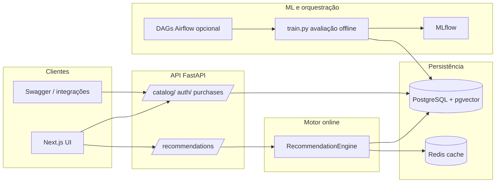

# Bookstore ML — Case de Engenharia de Machine Learning

Solução de referência para um marketplace de livros com **recomendações híbridas** (histórico + colaborativo + **pgvector** / embeddings semânticos), **decaimento temporal**, **pesos por categoria** configuráveis, **sinais demográficos** (região, idade, sexo), **MLflow**, **Airflow (DAGs)**, **CI/CD**, **Prometheus/Grafana** e **Docker Compose**.

## Índice (ordem sugerida)

| Ordem | Secção | Para quê |
|------:|--------|----------|
| 1 | [Visão geral](#1-visão-geral) | Entender o que o repositório faz em uma leitura |
| 2 | [Passo a passo: primeiro uso](#2-passo-a-passo-primeiro-uso) | Subir tudo e ter dados para testar na ordem certa |
| 3 | [Docker: subir e popular dados](#3-docker-subir-e-popular-dados) | Comandos detalhados (`compose`, seed fictício, perfil assertivo) |
| 4 | [Arquitetura (resumo)](#4-arquitetura-resumo) | Onde está cada peça no código |
| 5 | [Variáveis de ambiente](#5-variáveis-de-ambiente) | `.env`, pesos do motor, Redis, embeddings |
| 6 | [Embeddings e pgvector](#6-embeddings-e-pgvector) | Vetores semânticos e limitações em testes |
| 7 | [Erros da API (JSON)](#7-erros-da-api-json) | Formato de falhas nas rotas |
| 8 | [Testes](#8-testes) | Pytest e cobertura |
| 9 | [Comandos úteis e escala grande](#9-comandos-úteis-e-escala-grande) | Treino local, seed pesado |
| 10 | [Frontend](#10-frontend) | Next.js fora do Docker |
| 11 | [Airflow](#11-airflow) | DAGs |
| 12 | [Observabilidade](#12-observabilidade) | Métricas, Grafana, apresentação |
| 13 | [CI/CD e deploy da API](#13-cicd-e-deploy-da-api) | Imagem GHCR, atualização com menos interrupção |
| 14 | [Estrutura do repositório](#14-estrutura-do-repositório) | Pastas principais |
| 15 | [Documentação do case (entrega)](#15-documentação-do-case-entrega) | Objetivo, solução, técnica, plano, melhorias, conclusão |

---

## 1. Visão geral

- **Código**: [github.com/thejonathassilva/book-recomendation](https://github.com/thejonathassilva/book-recomendation) (repositório público de referência).
- **Problema**: recomendar livros combinando histórico do utilizador, gostos de leitores parecidos (demografia + comportamento) e **similaridade de texto** (embeddings em PostgreSQL com **pgvector**).
- **Como experimentar rápido**: Docker Compose sobe API, Postgres (com pgvector), Redis, MLflow; opcionalmente interface web e monitorização.
- **Dados de demo**: script sintético (`seed_data`) que gera utilizadores, livros, compras e avaliações para o motor ter sinal controlável.

---

## 2. Passo a passo: primeiro uso

Siga nesta ordem até conseguir abrir a API e o catálogo com dados.

1. **Clonar o repositório** (só precisas de **Docker** para o fluxo abaixo).
2. **Subir o backend**: `docker compose up -d --build` e aguardar os serviços ficarem saudáveis (`docker compose ps`).
3. **Popular a base de dados** com o seed sintético: `docker compose exec api python -m src.data.seed_data`  
   (opcional mais leve: `seed_data --users 500 --books 300 --purchases 8000`.)
4. **(Opcional)** **Embeddings** para o ramo semântico: `docker compose exec api python -m src.data.sync_book_embeddings` (demora; exige PyTorch no contentor).
5. **Abrir no browser**: API em [http://localhost:8000](http://localhost:8000), documentação em [/docs](http://localhost:8000/docs). Com perfil `ui`: [http://localhost:3001](http://localhost:3001). Após o seed: utilizador demo **demo@bookstore.com** / **demo123**; **administrador da loja** (painel de compras e livros na UI) **admin@bookstore.com** / **admin123**. **Painel admin**: [http://localhost:3001/admin](http://localhost:3001/admin) — requer login com conta `is_admin`. **Token estático da API** (ex.: `PATCH` de peso por categoria sem JWT): `ADMIN_TOKEN` + header `X-Admin-Token`; ver [Variáveis de ambiente](#5-variáveis-de-ambiente).
6. **(Opcional)** Afinar o motor com variáveis `REC_W_*` (ver [secção 3](#3-docker-subir-e-popular-dados) e [secção 5](#5-variáveis-de-ambiente)).

---

## 3. Docker: subir e popular dados

### Subir o stack

Backend (Postgres, Redis, MLflow, API):

```powershell
docker compose up -d --build
```

Com interface Next.js (porta **3001**):

```powershell
docker compose --profile ui up -d --build
```

Com Prometheus + Grafana:

```powershell
docker compose --profile monitoring up -d --build
```

**Tudo junto** (API, Postgres, Redis, MLflow, **UI** e **monitoring** num só comando):

```powershell
docker compose --profile ui --profile monitoring up -d --build
```

### Seed fictício (padrão do case)

**Padrão** (sem flags): **2000** utilizadores (inclui conta demo), **1500** livros, **48000** compras, **4000** avaliações — ver `src/data/seed_data.py` (`--users`, `--books`, `--purchases`, `--ratings`). **Embeddings** (pgvector + PyTorch): `--embed` no seed ou `sync_book_embeddings` depois (um vetor por livro).

```powershell
docker compose exec api python -m src.data.seed_data
docker compose exec api python -m src.data.sync_book_embeddings
```

Para subir mais rápido sem vetores: `seed_data --users 500 --books 300 --purchases 8000` (sem `--embed`).

### Ambiente limpo (zerar dados do Docker)

Para **apagar volumes** (Postgres zerado, etc.) e subir de novo:

```powershell
docker compose down -v --remove-orphans
docker compose up -d --build
docker compose exec api python -m src.data.seed_data
```

### Comportamento mais assertivo no motor

Com **embeddings** preenchidos, podes subir o peso de **vizinhos** (`REC_W_SIM`) e do **vetor** (`REC_W_VEC`) face ao histórico (`REC_W_OWN`). Exemplo: **0,30 / 0,45 / 0,25**. No Docker, descomenta as linhas `REC_W_*` em `docker-compose.yml` (serviço `api`), volta a fazer `docker compose up -d`; com Redis, invalida cache (`REC_CACHE_TTL`) ou reinicia a API.

### Onde clicar depois do seed

| Serviço | URL |
|--------|-----|
| API | http://localhost:8000 |
| Swagger | http://localhost:8000/docs |
| MLflow | http://localhost:5000 |
| UI (perfil `ui`) | http://localhost:3001 · cadastro em `/cadastro` |
| Painel admin (UI, JWT `is_admin`) | http://localhost:3001/admin — compras globais, CRUD de livros, atalhos MLflow |
| Prometheus (perfil `monitoring`) | http://localhost:9090 |
| Grafana (perfil `monitoring`) | http://localhost:3000 (admin/admin) |

**Nota sobre o motor**: **`REC_W_OWN` (histórico próprio)** só altera o score quando o utilizador **tem compras**. Sem compras, esse termo multiplica zero; a recomendação vem de **`REC_W_SIM`** e, com embeddings, de **`REC_W_VEC`** (incluindo cold start por vizinhos).

---

## 4. Arquitetura (resumo)

- **API**: FastAPI (`src/api/`) — auth JWT, catálogo, recomendações, métricas Prometheus em `/metrics`.
- **Motor de recomendação**: `src/recommendation/engine.py` — perfil próprio + colaborativo (demografia 30% / comportamento 70% na busca de vizinhos) + **similaridade vetorial** (`book_embeddings` com `sentence-transformers`, índice HNSW).
- **Treino / comparação de algoritmos**: `src/training/` — TF-IDF, user–user CF, SVD, XGBoost, MLP (proxy de NCF); métricas Precision@K, Recall@K, NDCG@K, MAP.
- **Dados**: PostgreSQL **com pgvector** (`pgvector/pgvector:pg16`), schema em `docker/init.sql`, seeds em `src/data/`.
- **Cache**: Redis (TTL recomendações; opcional se `REDIS_URL` vazio).
- **Orquestração**: DAGs em `dags/` (ETL, treino, avaliação, pré-compute Redis).
- **Frontend**: Next.js em `frontend/` (porta 3001).

---

## 5. Variáveis de ambiente

Copie `.env.example` para `.env`. **Ao mudar stack, env ou comportamento do motor**, mantém README e `.env.example` alinhados.

**Base**: `DATABASE_URL`, `REDIS_URL`, `MLFLOW_TRACKING_URI`, `JWT_SECRET`, `CONFIG_DIR`. Em desenvolvimento local sem Redis, deixa `REDIS_URL` vazio para desativar cache.

- **Treino sem servidor MLflow**: `MLFLOW_TRACKING_URI=file:./mlruns` (padrão no `train.py` se não definido).
- **Admin JWT**: utilizadores com `is_admin=true` na tabela `users` (seed: `admin@bookstore.com`) acedem a `GET /api/v1/admin/purchases`, `POST/PATCH /api/v1/admin/books`, e ao painel `/admin` na UI.
- **Admin token HTTP**: `ADMIN_TOKEN` — `PATCH /api/v1/catalog/categories/{id}/weight` com header `X-Admin-Token` (automação sem JWT).
- **Perfil para recomendações**: no cadastro (`POST /api/v1/auth/register`) informa `birth_date`, `gender` (M/F/Outro) e `region` (ex.: UF). Depois do login, `GET/PATCH /api/v1/users/me` ajusta nome e demografia usados na similaridade entre leitores; o **histórico de compras** vem das linhas em `purchases` (seed ou integração futura de checkout).
- **Pesos do motor (API)**: `REC_W_OWN`, `REC_W_SIM`, `REC_W_VEC` (padrão 0,50 / 0,35 / 0,15) — fusão histórico + colaborativo + vetor pgvector.
- **Cache de recomendações (Redis)**: `REC_CACHE_TTL` em segundos (padrão `3600`).
- **Modelo de embedding**: `EMBEDDING_MODEL` (opcional; padrão `paraphrase-multilingual-MiniLM-L12-v2`). Exige tabela `book_embeddings` preenchida (`sync_book_embeddings` ou `seed_data --embed`).
- **Métricas offline em `/metrics`**: `TRAIN_METRICS_EXPORT_PATH` aponta para o JSON gerado por `train.py` (no Docker a API usa `/app/data/train_metrics_last.json` via volume `./data`).

---

## 6. Embeddings e pgvector

- **Schema**: `docker/init.sql` cria `book_embeddings` (vetor **384** dimensões, alinhado ao modelo padrão) e índice **HNSW** (cosine).
- **Popular**: após seed ou ingestão de livros, `python -m src.data.sync_book_embeddings` ou `python -m src.data.seed_data --embed` (demora; carrega PyTorch / `sentence-transformers`).
- **Sem linhas na tabela**: o ramo semântico contribui **0**; histórico e colaborativo seguem ativos.
- **Testes locais** (`pytest`): costumam usar **SQLite** — pgvector fica desativado; o comportamento vetorial é exercitado em ambiente PostgreSQL.

---

## 7. Erros da API (JSON)

Falhas nas rotas retornam JSON no formato `{"error": {"code": "...", "message": "..."}}` (códigos estáveis em `src/api/errors.py`; handlers em `src/api/handlers.py`). Erros de validação (422) incluem `error.details` no estilo Pydantic. Erros não tratados respondem com `INTERNAL_ERROR` e são registados no log do processo (evita depender da mensagem em produção).

---

## 8. Testes

Suíte em `tests/` com **pytest** e **pytest-cov**. A cobertura **mínima de 80%** em `src/` é verificada no **CI** (`pytest … --cov-fail-under=80` na suíte completa). Localmente o `pyproject.toml` só liga o relatório de cobertura; para repetir o gate antes do push, usa `pytest tests/ --cov=src --cov-report=term-missing --cov-fail-under=80`. Os scripts de entrada (`seed_data`, `sync_book_embeddings`, `train`, `register`) estão **omitidos** do cálculo de cobertura.

```powershell
pytest tests/ -v
pytest tests/ -m "not slow"
pytest tests/ --cov=src --cov-report=term-missing --cov-fail-under=80
```

---

## 9. Comandos úteis e escala grande

```powershell
pip install -r requirements.txt
ruff check src tests
python -m src.training.train --mock
python -m src.data.seed_data --users 10000 --books 5000 --purchases 200000
python -m src.data.seed_data --embed
python -m src.data.sync_book_embeddings
```

### Escala grande (stress / muito insumo para treino)

Exemplo (**20k utilizadores, 100k livros, 3M compras, 200k avaliações**):

```powershell
docker compose exec api python -m src.data.seed_data --users 20000 --books 100000 --purchases 3000000 --ratings 200000
```

- **Faz sentido** para encher o pipeline de ML, stress do banco e gráficos de monitoração — desde que a máquina e o volume Docker aguentem.
- **Média** ~150 compras por utilizador (3M ÷ 20k), coerente com demo pesada.
- **`sync_book_embeddings`**: um vetor por livro → **~100k** embeddings; pode levar **muito tempo** e CPU (etapa separada).
- **Disco Postgres**: pode ir a **dezenas de GB** com dados + índices (pgvector HNSW em `book_embeddings` também ocupa espaço).
- **`train.py`**: com **milhões** de linhas em `purchases` pode exigir **muita RAM** ou evoluções futuras (chunking / amostragem).

---

## 10. Frontend

```powershell
cd frontend
npm install
$env:NEXT_PUBLIC_API_URL="http://localhost:8000"
npm run dev
```

Abre http://localhost:3001.

---

## 11. Airflow

DAGs estão em `dags/`. Para um ambiente Airflow completo, usa a imagem oficial, monta o repositório e instala dependências com `requirements-airflow.txt` (ver `Dockerfile.airflow`).

---

## 12. Observabilidade

Métricas em `/metrics`: latência de recomendação, contagem de predições, erros (`src/monitoring/metrics.py`). Após `python -m src.training.train`, o mesmo endpoint pode incluir **métricas offline** (`bookstore_offline_evaluation{algorithm,metric,k}`) a partir de `data/train_metrics_last.json` (`TRAIN_METRICS_EXPORT_PATH`). No Docker, a API monta `./data` para persistir esse JSON. Com o perfil `monitoring`, o Grafana provisiona o dashboard **Bookstore ML — avaliação offline (treino)**. PSI de exemplo em `src/monitoring/drift_detection.py` para jobs batch.

**Apresentação do case**: o treino imprime no console uma **métrica âncora** (por padrão `precision_at_10`, configurável em `config/train_config.yaml` em `presentation.primary_k`). Roteiro, frases e onde demonstrar (MLflow, Grafana, PromQL) estão em [`docs/apresentacao-metricas.md`](docs/apresentacao-metricas.md).

---

## 13. CI/CD e deploy da API

Repositório de referência: [github.com/thejonathassilva/book-recomendation](https://github.com/thejonathassilva/book-recomendation).

**Pipeline (`ML Pipeline CI/CD`)**: em cada push a `main`, após testes, lint e treino sintético (`--mock`), a imagem da **API** é construída e publicada no **GitHub Container Registry** (GHCR):

- `ghcr.io/thejonathassilva/book-recomendation/bookstore-api:<sha-do-commit>`
- `ghcr.io/thejonathassilva/book-recomendation/bookstore-api:latest`

(O caminho GHCR usa **sempre** dono e nome do repo em **minúsculas**.)

**Repositório público ≠ imagem pública.** O código no GitHub pode ser público e, mesmo assim, o **pacote** `bookstore-api` no GHCR pode ter nascido como **Private**. Nesse caso `docker pull` falha sem autenticação. Confere em **GitHub → Packages** (pacote associado ao repo) → **Package settings → Change package visibility** e define **Public** se quiseres `pull` anónimo. Se o pacote for **Private**, no servidor faz `docker login ghcr.io` com um **PAT** (scope `read:packages`) antes do `pull`.

**Atualizar só a API no servidor** (sem rebuild local do `Dockerfile`):

1. No host com o repositório e Docker Compose **2.23+** (extensão `!reset` em `docker-compose.image.yml`):
   ```bash
   export BOOKSTORE_API_IMAGE=ghcr.io/thejonathassilva/book-recomendation/bookstore-api
   export BOOKSTORE_API_TAG=latest   # ou o SHA completo do commit publicado pelo CI
   bash scripts/deploy-api.sh
   ```
2. O script faz `pull` da imagem e `up -d --no-deps api` (e `--wait` se o teu Compose suportar), reutilizando Postgres/Redis/MLflow já a correr. A API expõe `/health` e *healthcheck* no Compose para o contentor só receber tráfego quando estiver de pé.

**Deploy remoto opcional**: workflow **Deploy API (SSH)** (`workflow_dispatch`) em `.github/workflows/deploy-vps.yml`. Segredos: `VPS_HOST`, `VPS_USER`, `VPS_SSH_KEY`, `VPS_WORKDIR` (caminho do projeto no servidor), `BOOKSTORE_API_IMAGE` (ex.: `ghcr.io/thejonathassilva/book-recomendation/bookstore-api`). Isto automatiza o mesmo `deploy-api.sh` por SSH.

**Interrupção do serviço**: num único nó, o contentor da API reinicia e pode haver **alguns segundos** sem resposta. **Alta disponibilidade** (troca sem janela perceptível) exige **várias réplicas da API** atrás de um balanceador e política de *rolling update* (Kubernetes, Swarm, etc.) — fora do escopo deste compose de desenvolvimento.

**Treino em produção**: o CI **não** retreina com dados reais; apenas valida o código. Jobs Airflow ou cron no teu ambiente devem correr `train.py` contra a base real e publicar artefactos/métricas; a API pode continuar a servir com a imagem atual até ao próximo `deploy-api.sh`.

### Checklist — configuração no teu ambiente

1. **Primeiro push a `main`** que passe o workflow **ML Pipeline CI/CD** (o job `publish-image` publica no GHCR).
2. **Nome da imagem**: `ghcr.io/` + repositório GitHub **todo em minúsculas** + `/bookstore-api` (ex.: `ghcr.io/thejonathassilva/book-recomendation/bookstore-api`). Confirma em **GitHub → teu repo → Packages** (ou no log do job `publish-image`).
3. **Autenticação no GHCR no servidor**: só é obrigatória se o pacote `bookstore-api` for **Private** (ou se o `docker pull` falhar por permissão). Usa `docker login ghcr.io` com um **PAT** (Classic: `read:packages`). Repositório **público** com pacote **público** → normalmente **não** precisas de login para `pull`. O `GITHUB_TOKEN` do Actions trata do *push* da imagem; não precisas de PAT no CI para publicar.
4. **Servidor (VPS)**: Docker Engine + **Docker Compose v2.23+** (`docker compose version`). Clona o repo para um diretório fixo (ex.: `/opt/bookstore`) — é esse caminho que usarás em `VPS_WORKDIR` se activares o deploy por SSH.
5. **Primeira subida da stack**: no servidor, com `.env` / variáveis adequadas (`JWT_SECRET` forte, passwords Postgres, etc.), sobe Postgres + Redis + MLflow + API como no README (podes usar só `docker-compose.yml` com `build` na primeira vez, ou já com `docker-compose.image.yml` se exportares `BOOKSTORE_API_IMAGE` / `BOOKSTORE_API_TAG`).
6. **Atualizações só da API**: `export BOOKSTORE_API_IMAGE=...` e `BOOKSTORE_API_TAG=latest` (ou SHA) e `bash scripts/deploy-api.sh`.
7. **Deploy por GitHub Actions (opcional)**: **Settings → Secrets and variables → Actions** — cria `VPS_HOST`, `VPS_USER`, `VPS_SSH_KEY` (chave **privada** PEM, linha inteira), `VPS_WORKDIR`, `BOOKSTORE_API_IMAGE`. Depois **Actions → Deploy API (SSH) → Run workflow**.

---

## 14. Estrutura do repositório

Conforme o case: `src/api`, `src/training`, `src/recommendation`, `src/data`, `src/monitoring`, `dags/`, `config/`, `tests/`, `frontend/`, `docker-compose.yml`, `docker-compose.image.yml`, `scripts/deploy-api.sh`, `.github/workflows/ml-pipeline.yml`, `.github/workflows/deploy-vps.yml`.

---

## 15. Documentação do case (entrega)

Secção para **apresentação do case**: objetivo, visão de solução, visão técnica, como o trabalho foi encadeado, limitações honestas e fecho. O restante README continua a ser o **manual operacional** (Docker, testes, CI/CD).

### Objetivo e âmbito

- **Objetivo**: demonstrar um **marketplace de livros** com **recomendações híbridas** — histórico de compras, utilizadores semelhantes (demografia + comportamento) e, opcionalmente, **similaridade semântica** (embeddings + **pgvector**), com **pesos configuráveis** por tipo de sinal e por categoria.
- **Fora de âmbito** (explícito): recomendações em tempo real a escala de grandes retalhistas; **alta disponibilidade** multi-réplica; **pagamentos** reais; **modelo único** servido a partir do MLflow Model Registry; ETL de vendas de produção completo (existe DAG **placeholder**).
- **Critérios de sucesso do case**: stack **reproduzível** (Compose); **API** e **UI** demonstráveis; **motor** explicável; **treino offline** comparando algoritmos com métricas de ranking; **observabilidade** (métricas operacionais + eco das métricas de treino); **CI/CD** publicando imagem da API.

### Arquitetura de solução (negócio)

| Actor | Ação principal |
|--------|----------------|
| **Visitante / leitor** | Explora catálogo, regista-se, actualiza perfil (demografia), compra livros (simulado na API). |
| **Sistema de recomendação** | Calcula ranking personalizado por utilizador com base em histórico, vizinhos e vetores de texto. |
| **Administrador da loja** | Consulta compras globais, gere livros (API/UI), opcionalmente ajusta pesos de categoria (`ADMIN_TOKEN`). |
| **Equipa de ML / dados** | Corre seeds, treino, avaliação; consulta MLflow e dashboards Grafana (perfil monitoring). |

Fluxo resumido: **dados** (utilizadores, livros, compras) na **PostgreSQL** alimentam o **motor em runtime**; o **treino** lê os mesmos dados para **experimentos offline** e exporta métricas; **CI** valida código e publica a **imagem da API**.

### Arquitetura técnica (visão global)

Complementa a [secção 4](#4-arquitetura-resumo) (lista de componentes). Aqui: **fluxo de dados** e **fronteiras**.



- **Fronteira importante**: o **motor que responde em `/recommendations`** é o **`RecommendationEngine`** (código + dados na BD). O **MLflow** regista **runs de experimentos** (vários algoritmos, métricas offline); **não** há hoje promoção automática de um artefacto de treino para substituir esse motor.

### Plano de implementação (como o case foi encadeado)

Ordem lógica seguida no desenvolvimento (espelhada na estrutura do repo):

1. **Dados e persistência** — schema PostgreSQL (`docker/init.sql`), modelos SQLAlchemy, repositórios, **seed** sintético.
2. **Motor de recomendação** — fusão histórico / colaborativo / vetorial, pesos e cache Redis.
3. **API REST** — catálogo, auth, compras, recomendações, erros JSON consistentes.
4. **Treino e avaliação offline** — `train.py`, algoritmos comparáveis, MLflow, export `train_metrics_last.json`.
5. **Observabilidade** — Prometheus (`/metrics`), Grafana provisionado, métricas offline expostas via ficheiro.
6. **Frontend** — vitrine, conta, compras, painel admin.
7. **Orquestração (esboço)** — DAGs Airflow (ETL placeholder, treino, avaliação, warm cache).
8. **Qualidade e CI/CD** — pytest + cobertura, Ruff, pipeline GitHub Actions, imagem no GHCR, script de deploy da API.

### Limitações e melhorias futuras

| Área | Limitação actual | Melhoria típica |
|------|------------------|-----------------|
| **ETL** | `dag_etl_vendas` só valida conexão | Agregações, *feature store*, ingestão de ficheiros |
| **Treino ↔ produção** | Modelos do `train.py` não são servidos como artefacto único | `log_model`, registry, variável `MODEL_VERSION` na API |
| **Métricas online** | *Gauges* para CTR/drift sem job completo | Eventos *impression/click*, pipelines batch |
| **Orquestração** | DAGs independentes | Grafo único: dados → treino → avaliação → deploy |
| **Deploy** | Um contentor API, janela curta de restart | Réplicas + balanceador, *rolling update* |
| **Versionamento de dados** | Estado da BD no momento do treino | *Snapshots*, *data contracts*, linhagem |

### Considerações finais

Ao concluir este case, **priorizei** que qualquer pessoa conseguisse **reproduzir** o ambiente com Docker, repetir o seed e ver recomendações de ponta a ponta sem depender de infraestrutura fechada. Para mim, faz sentido manter o **motor de recomendação** (histórico, vizinhos e, quando há dados, vetores) **separado** dos experimentos no MLflow: assim ficou claro o que é **serviço em produção** e o que é **laboratório de comparação de algoritmos** — mesmo sabendo que, num cenário empresarial, eu ligaria depois artefactos de treino ao que corre na API.

As escolhas que mais me custaram a equilibrar foram **tempo** versus **realismo** (ETL completo, HA, métricas online de clique): deixei isso explícito nas limitações porque prefiro **assumir o recorte** a prometer um pipeline fechado que não está implementado. O que mais valorizo no que entreguei é a **explicabilidade** do ranking (pesos, perfil, vizinhos) e o facto de o stack já incluir **testes**, **observabilidade** e **CI/CD** como parte do aprendizado, não como extra opcional.

---
